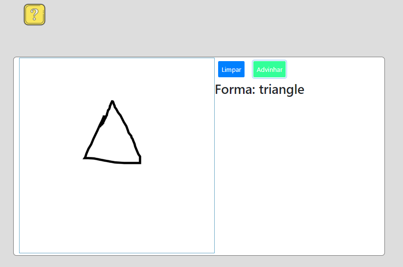

# Draw-Shapes
Python AI game for kids to learn geometric shapes
 
## Instructions:
* Download the project
* Install the required libs
* Access the digits folder and run the command: python manage.py runserver
* Access localhost at /draw/shapes/

